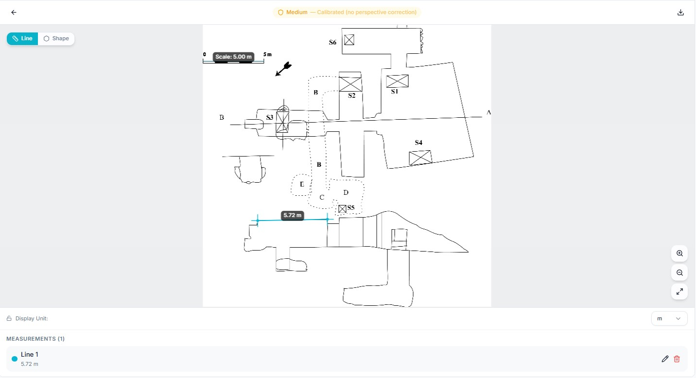

# AglanSuite – Archaeology-focused digital tools

A growing platform of specialized applications designed to support archaeological documentation, measurement, reconstruction, and publication.

---
## Core Capabilities

- Measurement from images  
- 2D/3D reconstruction workflows  
- Publication-ready outputs  
- Digital documentation for archaeological research  

---

## Applications Overview

### DiaSnap – Diameter from Arc Analysis
A tool for calculating object diameters based on arc segments in images.

---

### ScanSnap – Image-based Measurement
Allows precise measurement from calibrated images.

---

### PublishReady – Image Editor
Prepare images to meet scientific publication standards.

---
### ViewsBox 3D
Export six clean 3D views for publication and museum presentation.

---

### Assembly2D – Fragment Reconstruction
Digitally assemble 2D fragments with precise scaling, clean cutouts, and publication-ready export.

### Assembly3D – Fragment Reconstruction
3D environment for assembling archaeological fragments.

---

### ImageSync DB – Fragment Reconstruction
3D environment for assembling archaeological fragments.

## About the Project

AglanSuite is developed by Hassan Mahmoud (PhD in Egyptology), combining archaeological expertise with modern digital tools to improve documentation and analysis workflows.

---

## Status

This repository represents a public preview of the platform.  
Core systems and extended functionalities are under continuous development.
